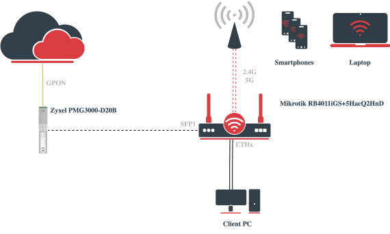
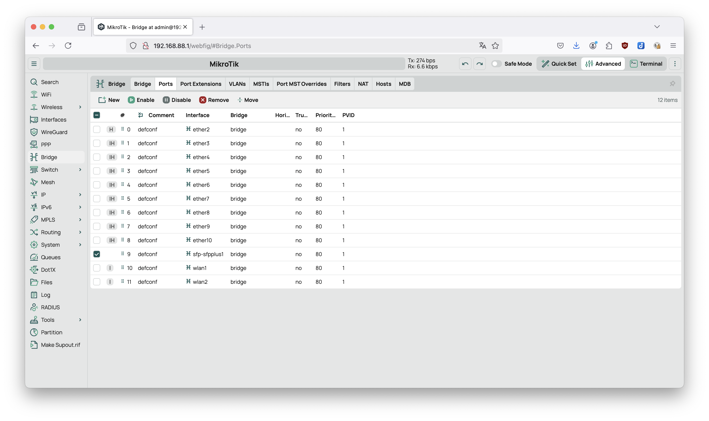
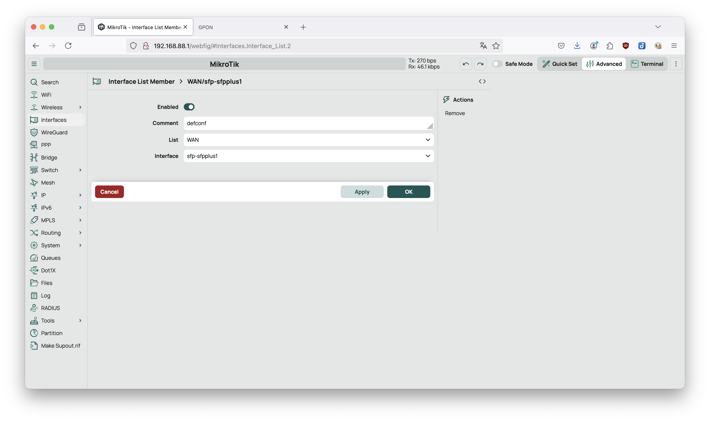
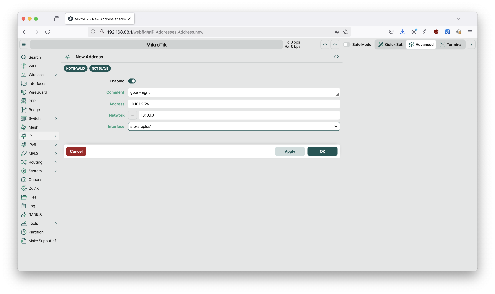
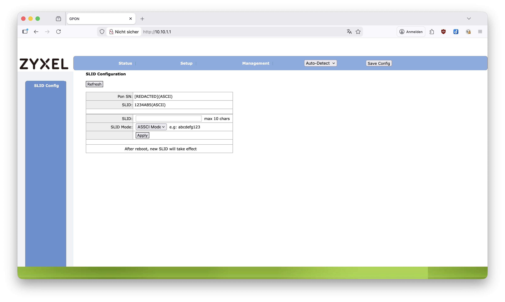
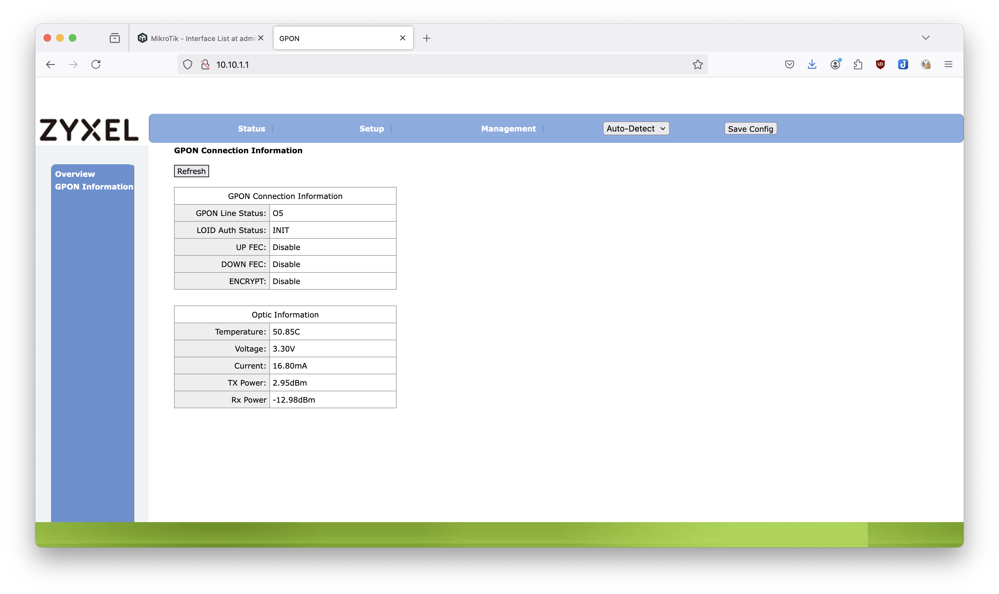
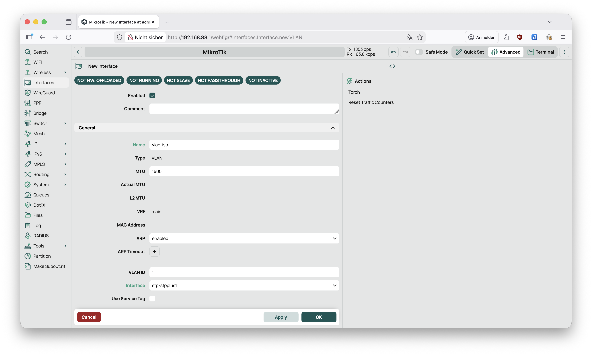
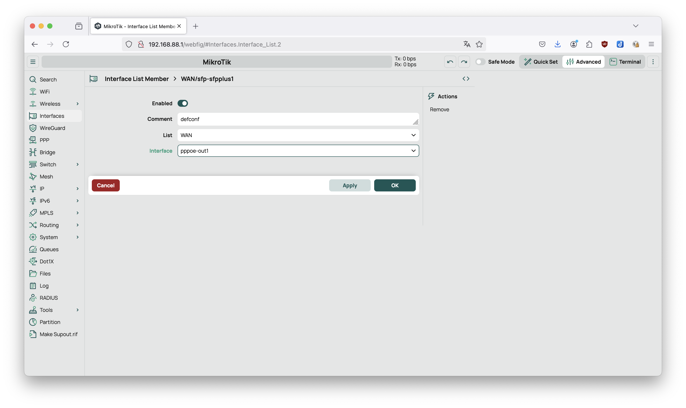

# Easybell Fiber with Mikrotik
An Zero To Hero Guide to Use an Mikrotik-Switch for an [easybell fiber business](https://www.easybell.de/business/internet-telefonie/) with static IP

## Used Hardware
- Mikrotik RB4011iGS+5HacQ2HnD (Router)
- Zyxel PMG3000-D20B (GPON SFP)

### Architecture


## Requirements
- Internet Access via IPv4 and IPv6
- Firewall
- DHCP-Server
- DNS-Server
- WiFi

## Preparation
In order to start with your adventure we need a bit of software, firmware and information before we are ready.

### Software & Firmware
Okay, before we can start we should install the mangament software for our Mikrotik Router (called WinBox) and it is helpful to get the latest firmware for your router as well. I recommend to download both main and external packages for our specific cpu architecture.

- [Mikrotik WinBox 4](https://mikrotik.com/download)
- [RouterOS v7 Stable](https://mikrotik.com/download)

### Information
Okay, you have ordered a (business) fiber access from easybell. This means in order to connect to easybell you have to provide them with a `Modem ID`. You can do that at the first day or beforehand. (Keep in mind that it does require some time until the `Modem ID` is configured on the providers side). In order to get this ID which is burned into your GPON Adapter you have to look onto the `Zxyel PMG3000-D20B` you want to use. It is a 16-character long string of hexadecimal characters.

When you're logged into the easybell system get your PPPoE username and password (label as `DSL Zugangsdaten`).

<!-- TODO: Get Glasfaser ID -->
<!-- TODO: Get Static IPv4 and IPv6 -->

### Assumtions
Everything is bougth of the shelf and reset to the default settings.

- `Zxyel PMG3000-D20B` is inserted into the SFP-Port of the `Mikrotik RB4011iGS+5HacQ2HnD`
- GPON Cable is pluged into the passiv ONT and into the `Zxyel PMG3000-D20B`
- Client Computer is plugged into `ETH2`
- `Mikrotik RB4011iGS+5HacQ2HnD` has power

## Configuration
### First Connetion to the Router
Normally, Mikrtik router come with a pre configured `DHCP` so you should get a IP automaticlly configured. When that happend you can check to access the router by opening [Mikrotik Router](http://192.168.88.1).

Set your new password. Default RouterOS has no preconfigured password (because everyone knows what there are doing when they buy that kind of hardware). So please set a new password to protect the access to this device.

Okay, first setup up the correct configuration. In my default config the SFP port is mapped to the bridge network. That won't work. So lets delete this entry by going to `Bridge`->`Ports` and find the entry based on the following screenshot.



In order for RouterOS to know which port is considers `WAN` we have to swap the `eth1` with the `sfp-sfpplus1`. Go to `Interfaces`->`Interface List` and change the interface for `WAN` accordingly.



Next we want to access the WebUI of the `GPON` Adapter. For that we need to configure the correct IP-Address. That is done inside `IP`->`Addresses`->`New` and filled with the following values:

```yaml
comment: gpon-mgnt
address: 10.10.1.2/24
network: 10.10.1.0
interface: sfp-sfpplus1
```



Now you should be able to open the [GPON Web UI](http://10.10.1.1) Username is `admin` and passwort is `1234` by default. There go to setup and paste your SLID (in easybell labeled as `Glasfaser ID`) into the form and select the `ASCII Mode` (Note: I think there is a type here because it says `ASSCI`). This might not be required!



Restart your Router now.

Via the GPON Web UI you can check if the fiber is connected with the other (active) side. It sould say 
```log
GPON Line Status:  	 O5
LOID Auth Status:  	 INIT
```



Now that we have access to the provider we have to authenticate us as we are against them. For that we use `PPPoE`. But before we can do that we have to configure a VLAN on top of the `sfp-sfpplus1`. (Story: easybell uses `Telekom` fiber and one little quirk they do is that they required the `VLAN` for the PPPoE Client set to `7`). Go to `Interfaces`->`New`->`VLAN` and fill with the following values:

```yaml
name: vlan-isp
vlan-id: 7
interface: sfp-sfpplus1 
```



Now that's out of the way we can proceed with configuring the `PPPoE-Client`. Go to `Interfaces`->`New`->`PPPoE Client` and fill out the following values:

```yaml
name: pppoe-out1
interface: vlan-isp
user: <Look in your notes>
password: <Look in your notes> 
use-peer-dns: true
```

Okay now the router should have internet but unfortunatlly you don't. (Have you heard of a firewall well I guess) The pppoe-out1 is currently not labled as `WAN` interface. The default firewall rules are based on the two labels `LAN` and `WAN`. You know what you have to do. Go to `Interfaces`->`Interface List` and change the interface for `WAN` accordingly.



Okay lets check it do we have access to [Google](https://www.google.com)

### NAT for Zyxel
If you want to connect to your Management UI of the Zyxel SFP Module you could add a NAT configuration.

Go to `IP`->`Firewall`->`NAT`->`New` and fill out the following values:

```yaml
comment: zyxel-mngt
destination-address: 10.10.1.1
out-interfaces: sfp-sfpplus1
action: masquerade
```

This configuration however shouldn't be enabled all the time or it needs adjustments if used in a business environment because now everyone could (a) connect to the web ui (a), (b) restart the SFP Module and (c) connect to the ssh shell. So if you are not sure disable the NAT-rule as long as you don't need to connect to Zyxel UI.

### Let's do it IPv6
The following part to configure IPv6 is based on a [Forum Post](https://administrator.de/tutorial/ipv6-mittels-prefix-delegation-bei-pppoe-mikrotik-632633.html) which mentions the process with RouterOS v6.

Go to `IPv6`->`ND`->`Interfaces` and change the default configuration according the following values:

```yaml
interface: bridge
```

Go to `IPv6`->`DHCP Client`->`New` and add the configuration according the following values:

```yaml
interface: pppoe-out1
request:
  - prefix
pool-name: pool-easybell-ipv6
add-default-route: true
```

Go To `IPv6`->`Addresses`->`New` and add the configuration according the following values:
```yaml
address: ::/64
from-pool: pool-easybell-ipv6
interface: bridge
advertise: true
```

Go To `IPv6`->`Firewall`->`New` and and the configuration according the following values:
```yaml
comment: accept UDP traceroute
chain: forward
protocol: udp
dst-port: 33434-33534
action: accept
```

## Honerable Metions:
- [GitHub: zyxel-gpon-sfp](https://github.com/xvzf/zyxel-gpon-sfp)
